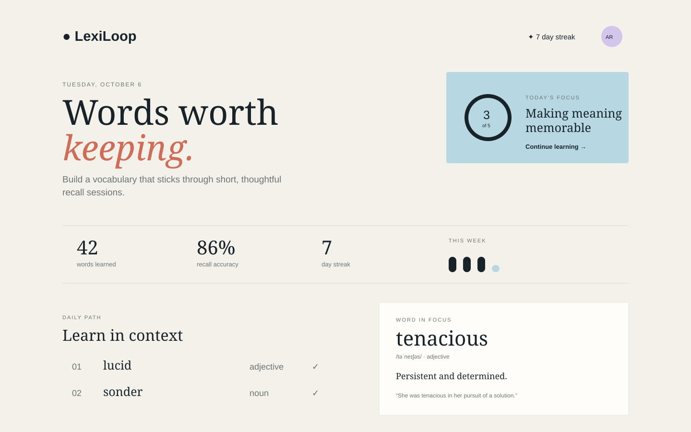
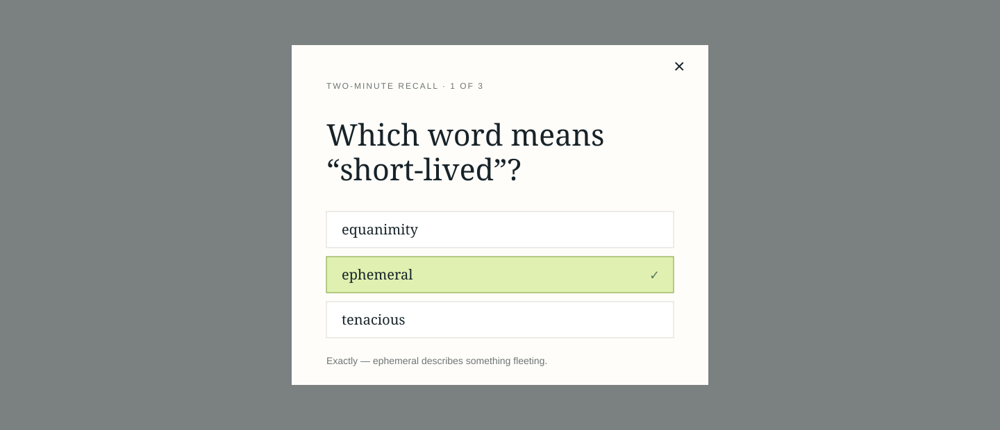

# LexiLoop

LexiLoop is a calm, recall-first vocabulary practice app that helps learners turn interesting words into words they can actually use.





## Why it matters

Looking up a word is easy; retaining it is the difficult part. LexiLoop combines a small daily path, contextual examples, pronunciation, and active recall to make practice feel focused rather than overwhelming.

## Features

- A five-word daily learning path with clear completion state
- Word definitions, phonetic pronunciation, and contextual examples
- Built-in browser pronunciation support
- A two-minute active-recall check with instant feedback
- Visible streak, accuracy, and weekly activity indicators
- Responsive interface for desktop and mobile

## Tech stack

- Vanilla HTML, CSS, and JavaScript
- Node.js static development server
- Native Web Speech API for pronunciation

## Getting started

```bash
git clone https://github.com/yourname/lexiloop.git
cd lexiloop
npm start
```

Open `http://localhost:3000`.

## Testing

```bash
npm test
```

## Architecture

The interface is a lightweight single-page application. `src/app.js` owns the vocabulary data and user interactions, while `src/styles.css` contains the responsive visual system. The small Node server is only used to serve the static app locally.

## What I learned

This project explores how interaction design can support memory: a constrained daily path reduces cognitive load, while a low-stakes recall prompt asks learners to retrieve rather than reread. I also used progressive states so the app communicates momentum without relying on complex backend infrastructure.

## Future improvements

- Persist learning history and personal word collections
- Add spaced-repetition scheduling and adaptive review sessions
- Support custom lists, definitions, and import/export
- Add accessibility preferences and keyboard-first study flows

## License

MIT
